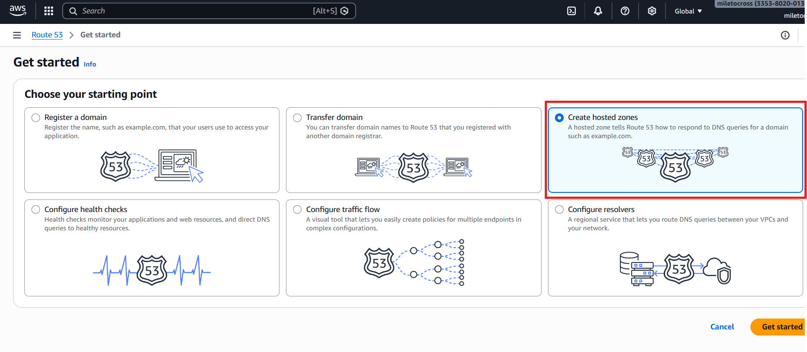
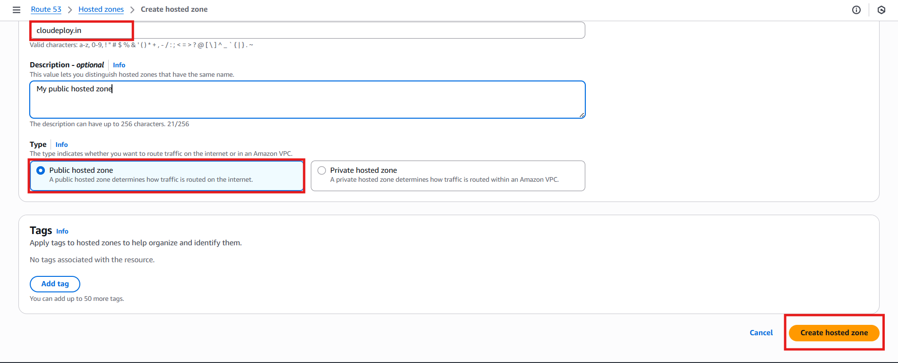
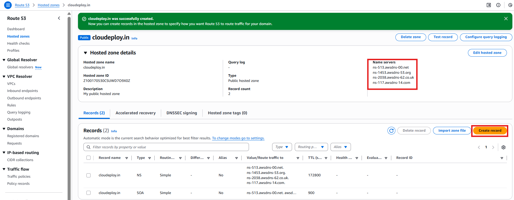
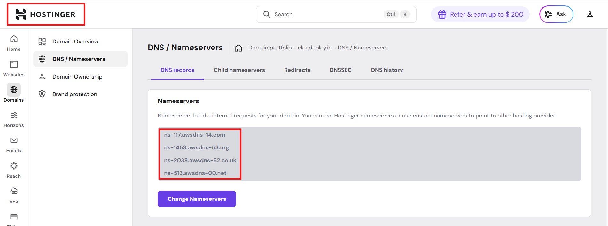
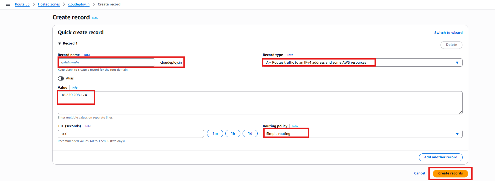
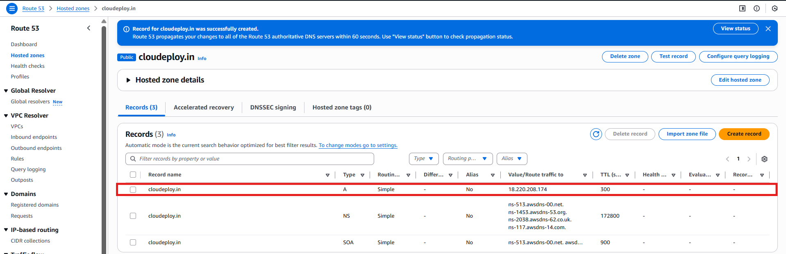
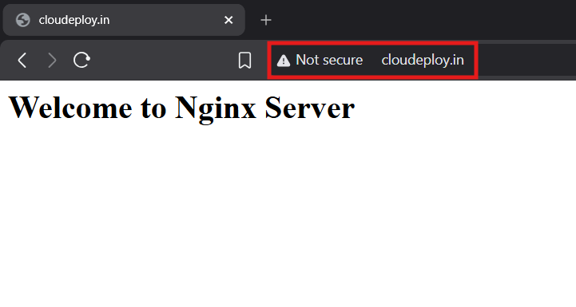
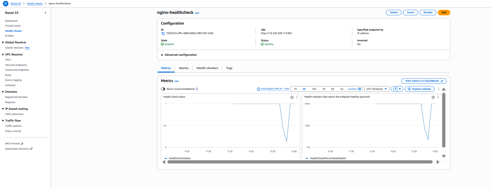
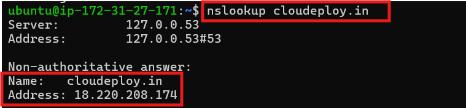

Route 53 DNS Management – Configure and manage DNS records for custom domains.

Amazon Route 53 is a scalable and highly available Domain Name System (DNS) web service. It helps route end users to applications by translating domain names(e.g., example.com) into IP addresses. In this project, we will configure and manage DNS records for a custom domain using Route 53.


#### Steps to Complete the Project

User → Route 53 → EC2 (single instance) → Nginx

Create an EC2 instance with Nginx installed

1. Register a Domain (Optional)
- If you don’t have a domain, register one using Route 53 or any domain registrar like Hostinger, GoDaddy, Namecheap, etc.

- If using Route 53:
   - Navigate to AWS Route 53 Console.
   - Click "Registered domains" > "Register Domain".
   - Choose a domain, provide details, and complete the purchase.


2. Create a Hosted Zone
- A Hosted Zone manages DNS settings for your domain.

   - Open Route 53 in the AWS Console.
   - Click "Hosted Zones" > "Create Hosted Zone".
   - Enter your domain name and choose Public Hosted Zone.
   - Click "Create".
   - Note the Name Server(NS) records displayed.

   

   


3. Update Name Servers (If Not Using Route 53 Domain)

   - If your domain is registered with another provider, update the NS records in the provider's dashboard.
   - Copy the NS records from Route 53 and update them in your domain registrar’s settings.

   

   


4. Configure DNS Records
- Click on your Hosted Zone and add records based on your needs:
   ○ A Record (IPv4 Address) – Maps domain to an IP.[ In this demo, we create an "A" record of "simple routing"
   type] 
   ○ CNAME Record – Maps domain to another domain (e.g., www.example.com -> example.com).
   ○ MX Record – Routes email for your domain.
   ○ TXT Record – Used for domain verification (e.g., AWS SES, Google Workspace).

Steps to add a record:
   - Click "Create Record".
   - Choose the Record Type (A, CNAME, MX, etc.).
   - Enter the domain/subdomain (e.g., www.example.com).
   - Provide the value (IP, another domain, or text value).
   - Click "Create Records".

   

   


   When you open:
   ```
   http://cloudeploy.in
   ```
   You should see your custom Nginx index.html served from your EC2 instance.
   

   

   

5. Configure Health Checks (Optional)
   - Health checks monitor endpoint availability. 
   
   - Open Route 53 Console > Click Health Checks.
   - Click Create Health Check.
   - Provide the IP or domain of the endpoint to monitor.
   - Set failure thresholds and notifications.
   - Save the health check.

   


6. Enable Route 53 Traffic Routing (Optional)
   - Route 53 allows Geolocation, Latency, Weighted, and Failover Routing.
   - Example: Latency-based routing directs users to the closest AWS region.


7. Test DNS Configuration
Use tools like:
   - nslookup (nslookup example.com)
   - dig (dig example.com)
   - Route 53 Test Record Set
   
   

8. Upgrades
   - Elastic IP -> avoid IP change
   - HTTPS via ACM + ALB
   - Auto Scaling Group
   - CloudFront in front of EC2
   - Connect Route 53 with an S3 Static Website


Conclusion

*Configured a custom domain using Amazon Route 53 with authoritative DNS delegation and deployed an Nginx web server on EC2 to serve static content.*
*With Route 53, you can efficiently manage DNS for your custom domain, ensuring high availability, traffic control, and integration with AWS services*

**More to know:**

Route 53 hosted zones are global and can contain records pointing to resources in any AWS region using routing policies like failover or latency-based routing.

Region does NOT matter for Route 53 hosted zones. One hosted zone can point to resources in any AWS region (or even outside AWS).

Record ID is an internal Route 53 identifier required for routing policies to distinguish multiple records with the same name and type. You ONLY need a Record ID when:

- Failover routing
- Latency routing
- Weighted routing
- Geolocation routing
- Multi-value answer routing
If you use Simple routing, you won’t even see this field.

Route 53 health checks are useful only when paired with routing policies like failover; they don’t replace load balancer health checks.

   User
      ↓
      Route 53 (Failover routing + Health Check)
         ├─ Primary → EC2 (Region A) → Nginx
         └─ Secondary → EC2 (Region B) → Nginx

   - Good for:
      - Disaster recovery
      - Region-wide outages
      - Simple static sites
      - Learning DNS internals

User data for Installing Nginx:

```
#!/bin/bash

# 1. Update the package list
echo "--> Updating system packages..."
sudo apt-get update -y

# 2. Install NGINX
echo "--> Installing NGINX..."
sudo apt-get install nginx -y

# 3. Start and enable the NGINX service
echo "--> Starting and enabling NGINX service..."
sudo systemctl start nginx
sudo systemctl enable nginx

```