## Scalable Web App with ALB & Auto Scaling – Use EC2, ALB, and Auto Scaling for high availability.

### This project involves deploying a highly available web application using Amazon EC2, Application Load Balancer (ALB), and Auto Scaling. The goal is to ensure that the web app can scale automatically based on traffic demand while maintaining availability.

#### Steps to Deploy a Scalable Web App

### Step 1: Create a Launch Template

1. Go to AWS Console -> EC2 -> Launch Templates → Create Launch Template.

2. Configure:
- Name: WebAppTemplate
- AMI: Amazon Linux 2 or Ubuntu
- Instance Type: t2.micro (Free Tier) or t3.medium
- Key Pair: Select an existing key pair or create a new one.
- Security Group: Allow SSH (22), HTTP (80), and HTTPS (443).


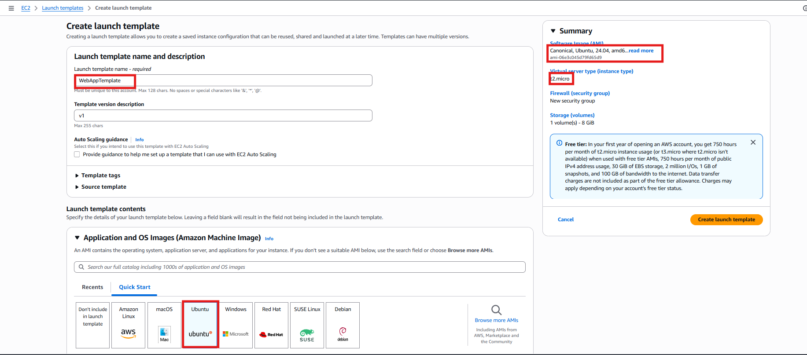

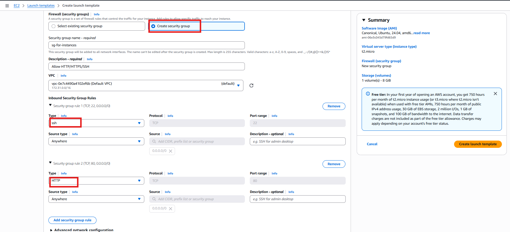

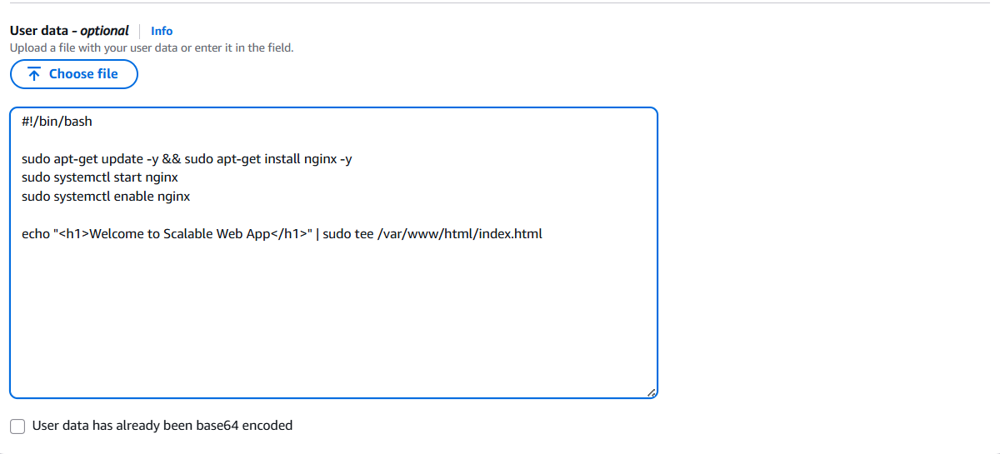


User Data (Optional, for auto-installation of Nginx):
```
#!/bin/bash

sudo apt-get update -y && sudo apt-get install nginx -y
sudo systemctl start nginx
sudo systemctl enable nginx

echo "<h1>Welcome to Scalable Web App</h1>" | sudo tee /var/www/html/index.html
```

3. Click Create Launch Template.

### Step 2: Create an Auto Scaling Group

1. Go to EC2 -> Auto Scaling Groups -> Create Auto Scaling Group.

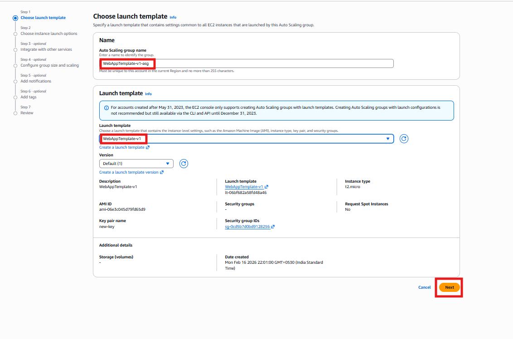

2. Choose Launch Template: Select WebAppTemplate.

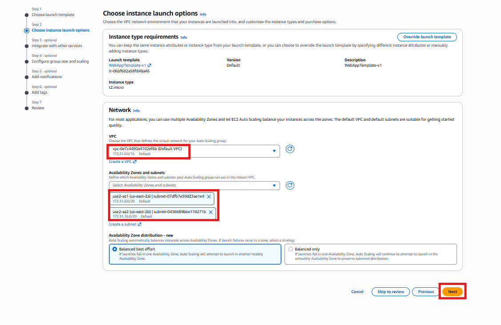


3. Attach New Load Balancer:
- Choose Application Load Balancer (ALB).
- Create Target Group:
- Target Type: Instance
- Protocol: HTTP
- Health Check: /
- Register instances later (Auto Scaling will handle this).

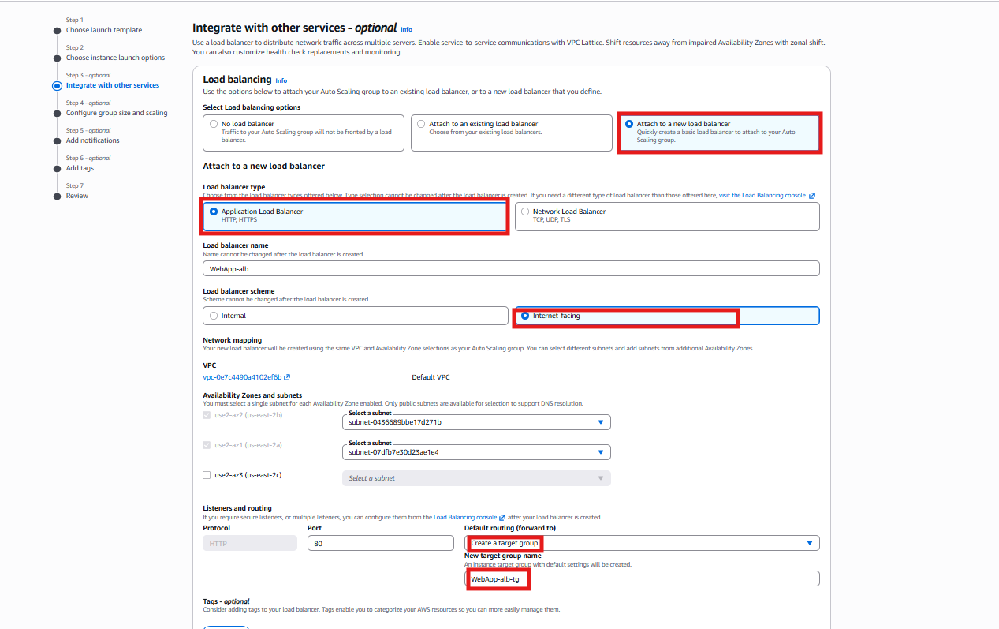

4. Configure Group Size:
- Desired Capacity: 2
- Minimum Instances: 1
- Maximum Instances: 3

5. Select Network:
- Choose an existing VPC.
- Select at least two subnets across different Availability Zones (AZs).

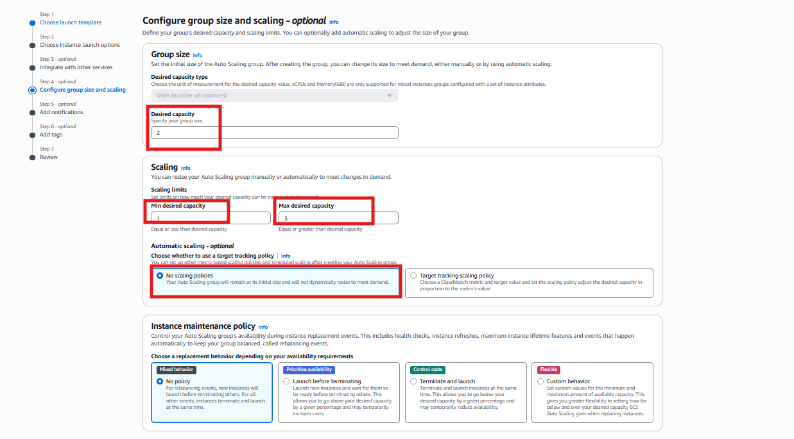


6. Set Scaling Policies (Optional):
- Enable Auto Scaling based on CPU utilization.
- Example Policy: Scale out when CPU > 60%, Scale in when CPU < 40%.

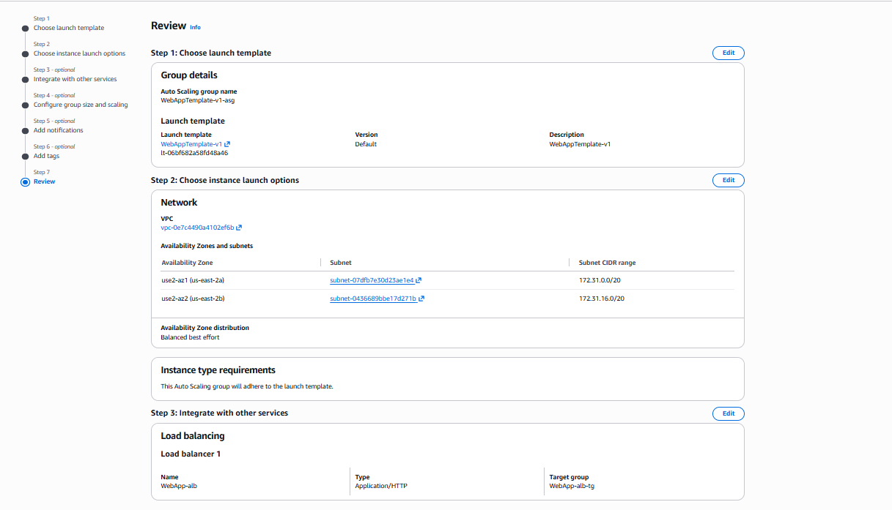

7. Click Create Auto Scaling Group.

### Step 3: Create an Application Load Balancer (ALB) if not created during the ASG creation time

1. Go to EC2 > Load Balancers -> Create Load Balancer.

2. Select Application Load Balancer.

3. Configure Basic Settings:
- Name: WebApp-alb
- Scheme: Internet-facing
- VPC: Select the same VPC as Auto Scaling.
- Availability Zones: Choose at least 2.

4. Configure Listeners:
- Protocol: HTTP
- Port: 80

5. Target Group:
- Select existing Target Group (from Auto Scaling Group).

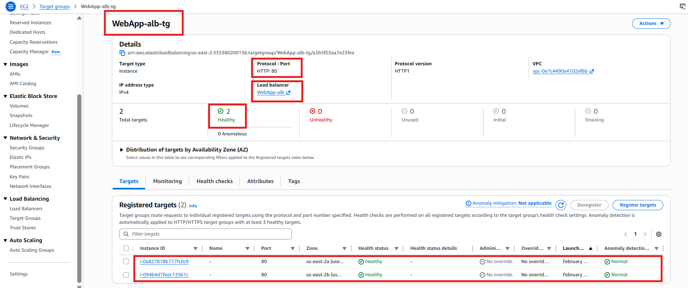

6. Security Group:
- Allow HTTP (80).

7. Click Create Load Balancer.

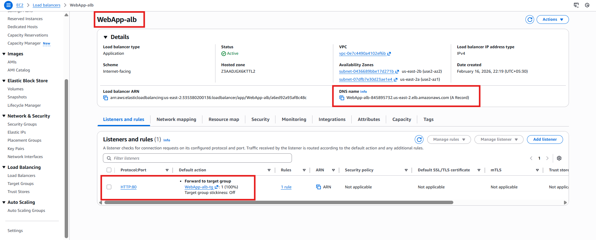

### Step 4: Test the Setup

1. Get ALB DNS Name:
- Go to EC2 -> Load Balancers -> Copy the ALB DNS Name.

Open a browser and enter:

```
http://your-alb-dns-name
```
You should see:
Welcome to Scalable Web App

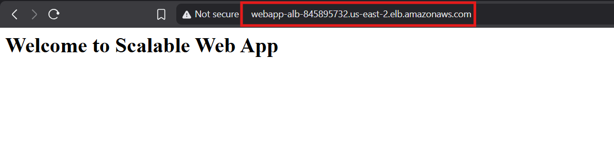

### Step 5: Verify Auto Scaling

1. Stop an Instance:

- Manually stop an instance to verify if Auto Scaling replaces it.

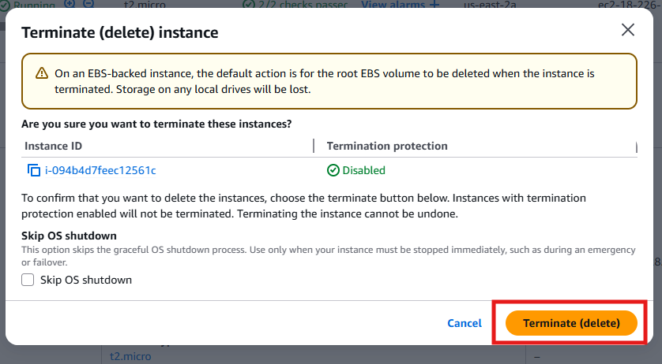

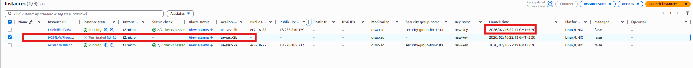

Conclusion

This setup ensures: 
- High Availability using ALB
- Scalability using Auto Scaling
- Redundancy across multiple AZs

*This architecture is commonly used for production applications that need reliability and cost optimization.*