## Static Website Hosting using S3, Route 53 & CloudFront 

### Hosting a static website on Amazon S3, integrating it with Route 53 for domain name resolution, and using CloudFront for content delivery enhances performance, security, and reliability

Prerequisites:
✅ An AWS account
✅ A registered domain (either in Route 53 or another provider(GoDaddy, Hostinger, NameCheap etc..))

#### Complete Steps


#### Step 1: Create an S3 Bucket for Website Hosting

1. Open the AWS S3 Console and click Create bucket.
2. Bucket name: Enter your domain name (e.g., example.com).
3. Region: Select your preferred AWS region.
4. Disable Block Public Access:
  - Uncheck "Block all public access" and confirm changes.
5. Enable Static Website Hosting:
  - Go to the Properties tab.
  - Click Edit under Static website hosting.
  - Select Enable.
  - Choose "Host a static website".
  - Set index document as index.html.
  - Note the Bucket Website Endpoint URL.
6. Click Create bucket

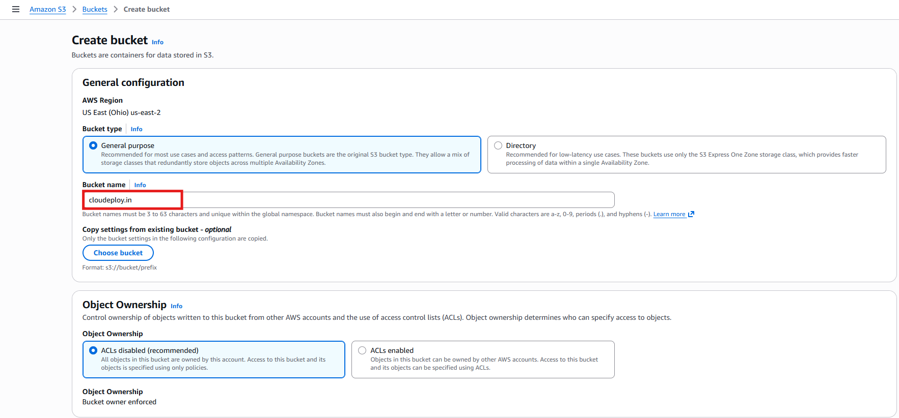

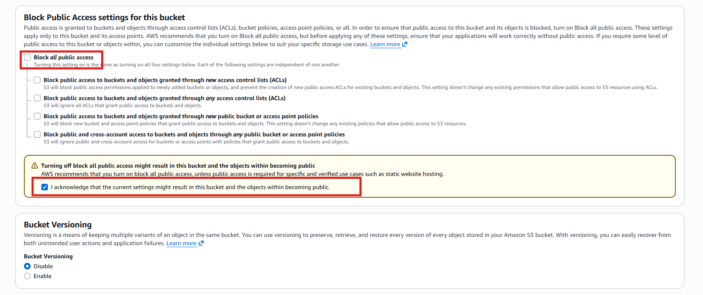

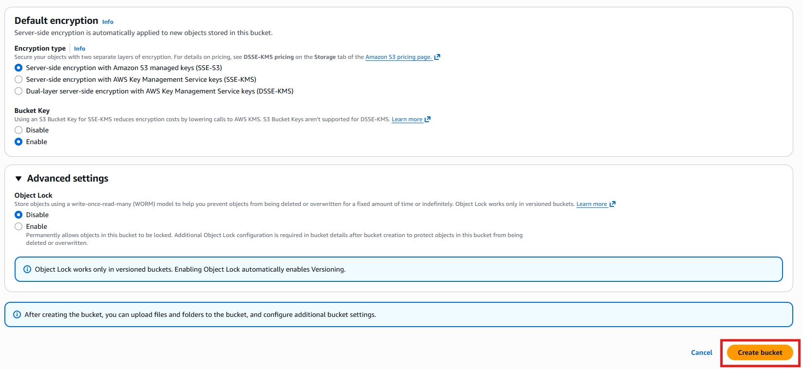

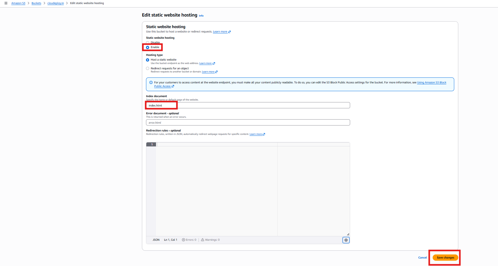

#### Step 2: Upload Website Files

1. Open your S3 bucket.
2. Click Upload -> Add your index.html, style.css, script.js, etc.
3. Click Upload.

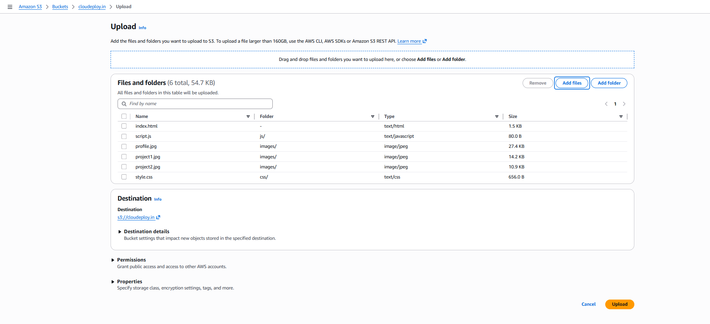

#### Step 3: Configure S3 Bucket Policy for Public Access

1. Go to the Permissions tab.
Under Bucket Policy, click Edit and paste the following JSON policy:

json
```
{
"Version": "2012-10-17",
"Statement": [
{
"Effect": "Allow",
"Principal": "*",
"Action": "s3:GetObject",
"Resource": "arn:aws:s3:::example.com/*"
}
]
}
```
2. Replace example.com with your bucket name.
3. Click Save changes

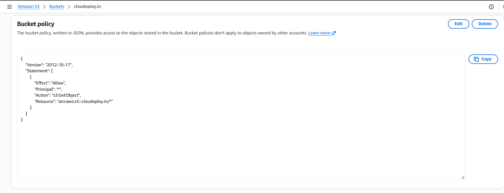

#### Step 4: Register a Domain (if needed) in Route 53 (I skipped, I have a domain)

1. Open AWS Route 53 Console.
2. Click Domains -> Register Domain.
3. Search for and purchase a domain (e.g., example.com).
4. Wait for AWS to complete registration.


#### Step 5: Create a Hosted Zone in Route 53 (I already own a Domain)

1. In Route 53, go to Hosted Zones.
2. Click Create hosted zone.
3. Enter your domain name (example.com).
4. Choose Public Hosted Zone.
5. Click Create.
6. Update the Name servers in Domain Registrar.

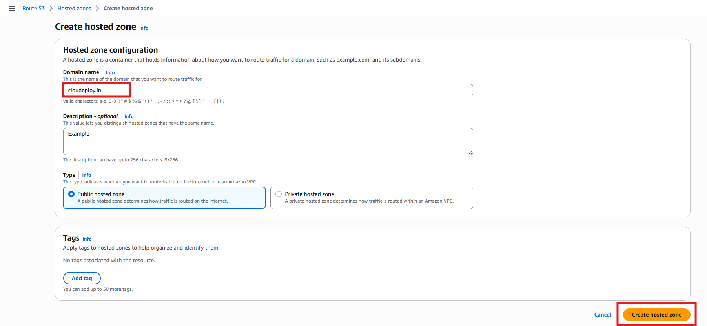

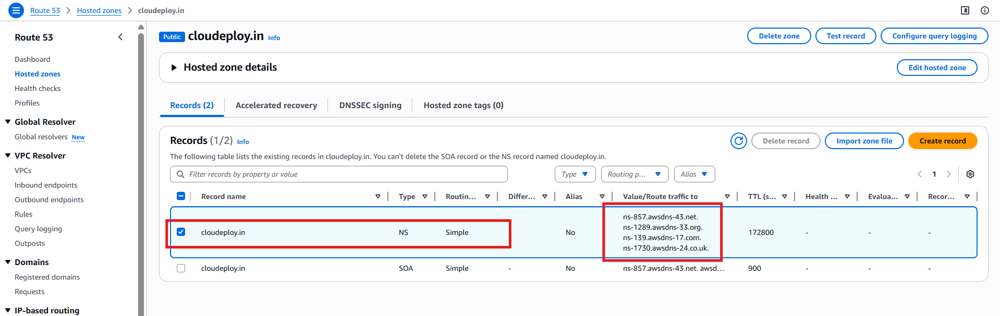

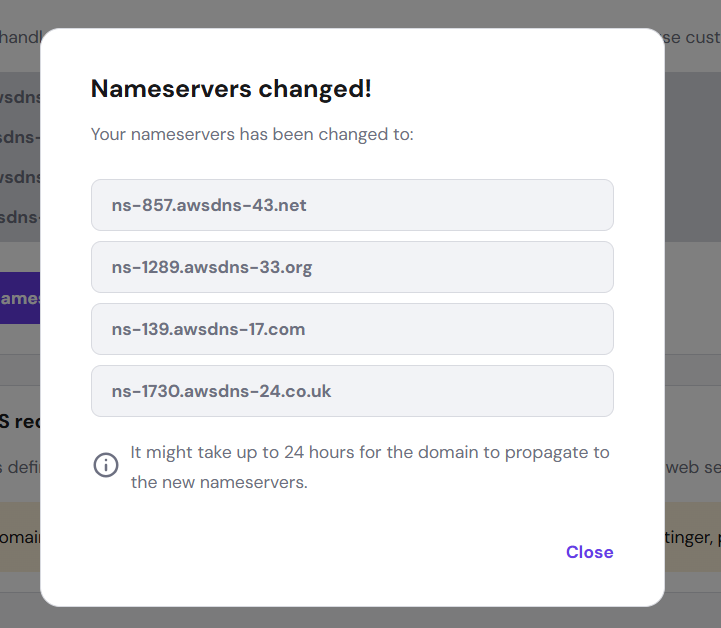


#### Step 6: Set Up CloudFront for Content Delivery

1. Open AWS CloudFront Console.
2. Choose a Plan (Free) and Click Create distribution.
3. Specify origin: Choose Origin type as Amazon S3 and Under Origin, configure:
  - S3 Origin: Browse and choose your S3 website endpoint.
   Settings :
  - Origin settings : Use recommended origin settings
    Origin settings control how CloudFront connects to the specified origin.
  - Cache settings
    Cache settings determine when CloudFront serves cached content and when it fetches new content from the origin.
  - Allowed HTTP methods: GET, HEAD
  - Viewer Protocol Policy: Choose Redirect HTTP to HTTPS.

4. Enable security : Skip
 
5. Get a TLS Certificate :

5. Create from ACM a Custom SSL Certificate (if not fromCloudFront):
  - Click Request or Import a Certificate with ACM.
  - Request an SSL certificate for your domain.
  - Validate via DNS.
  - Once issued, attach it to the CloudFront distribution.
6. Click Create distribution and wait for deployment.

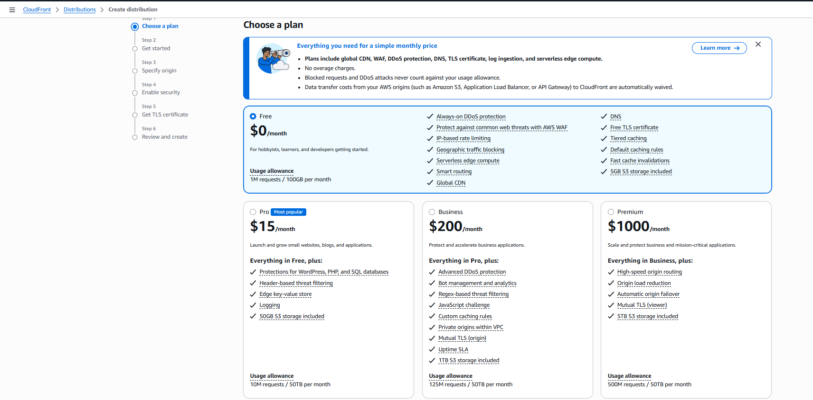

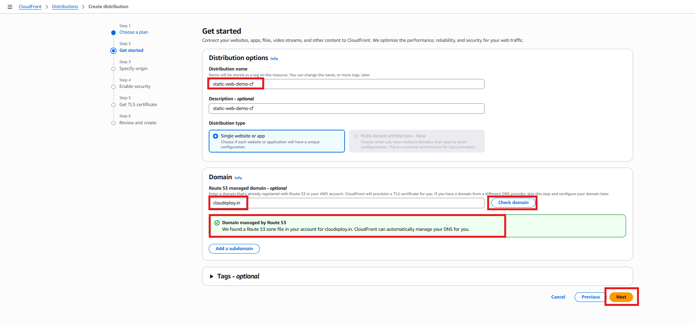

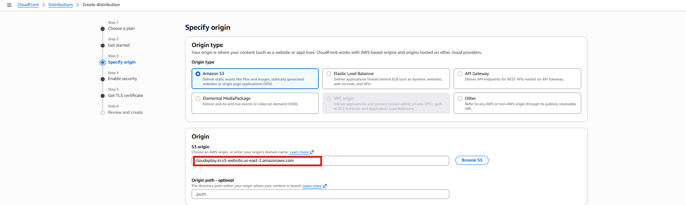

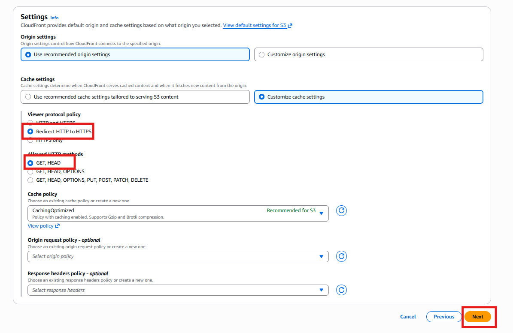

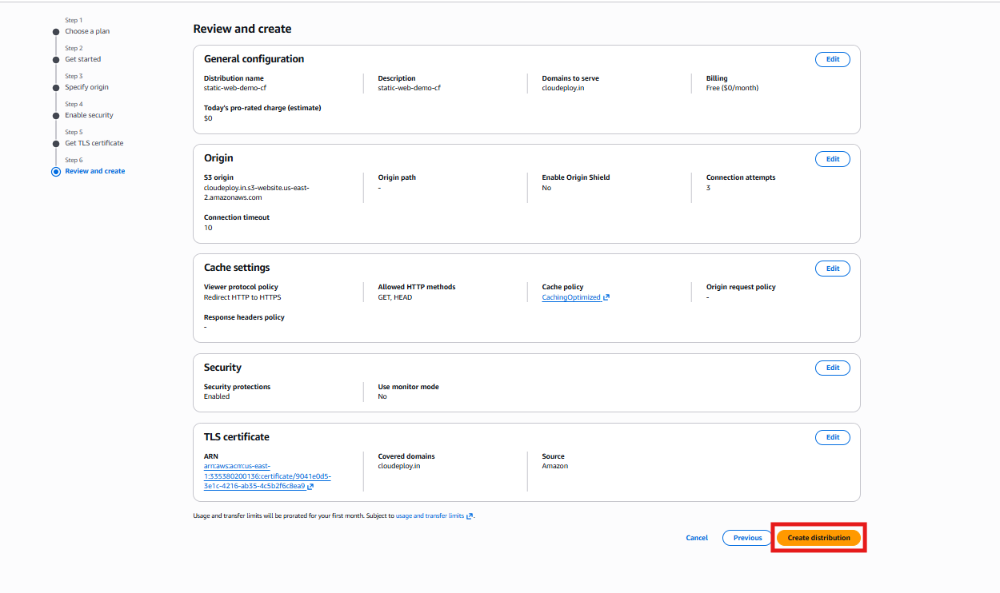

#### Step 7: Update Route 53 DNS Records

1. Go to Route 53 -> Hosted Zone -> Select your domain.
2. Click Create record.
3. Select Simple routing -> Define simple record.
4. Record Name: Leave empty (for root domain).
5. Record Type: Select A – IPv4 Address.
6. Route Traffic To: Choose Alias to CloudFront Distribution.
7. Select your CloudFront distribution from the dropdown.
8. Click Create record.

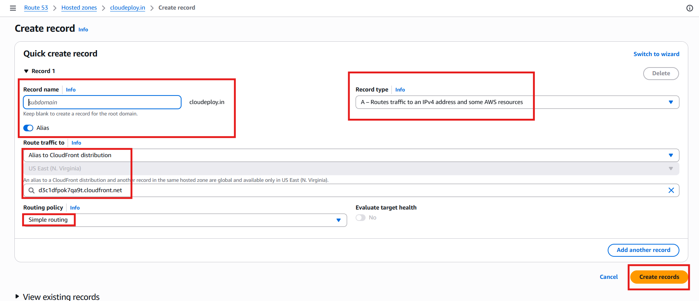

#### Step 8: Verify and Test the Website

- Open a browser and visit your domain (https://example.com).
- If it doesn't work immediately, wait for DNS propagation (~30 mins to a few
hours).

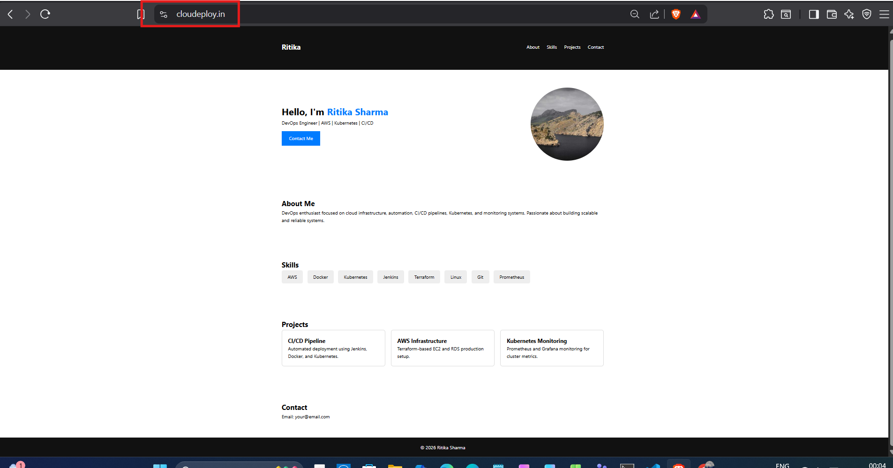


*Summary of What We Did:*

✅ Created an S3 bucket for hosting static website files.
✅ Configured public access & bucket policy for static hosting.
✅ Registered a domain and set up a hosted zone in Route 53.
✅ Created a CloudFront distribution for security & performance.
✅ Configured Route 53 DNS records to point the domain to CloudFront.
✅ Secured the website with SSL (HTTPS) using AWS ACM.

🚀 Your static website is now hosted on AWS S3, accessible via a custom domain
with CloudFront caching!


